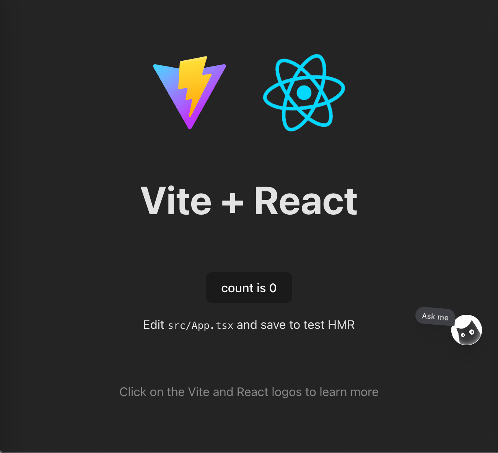
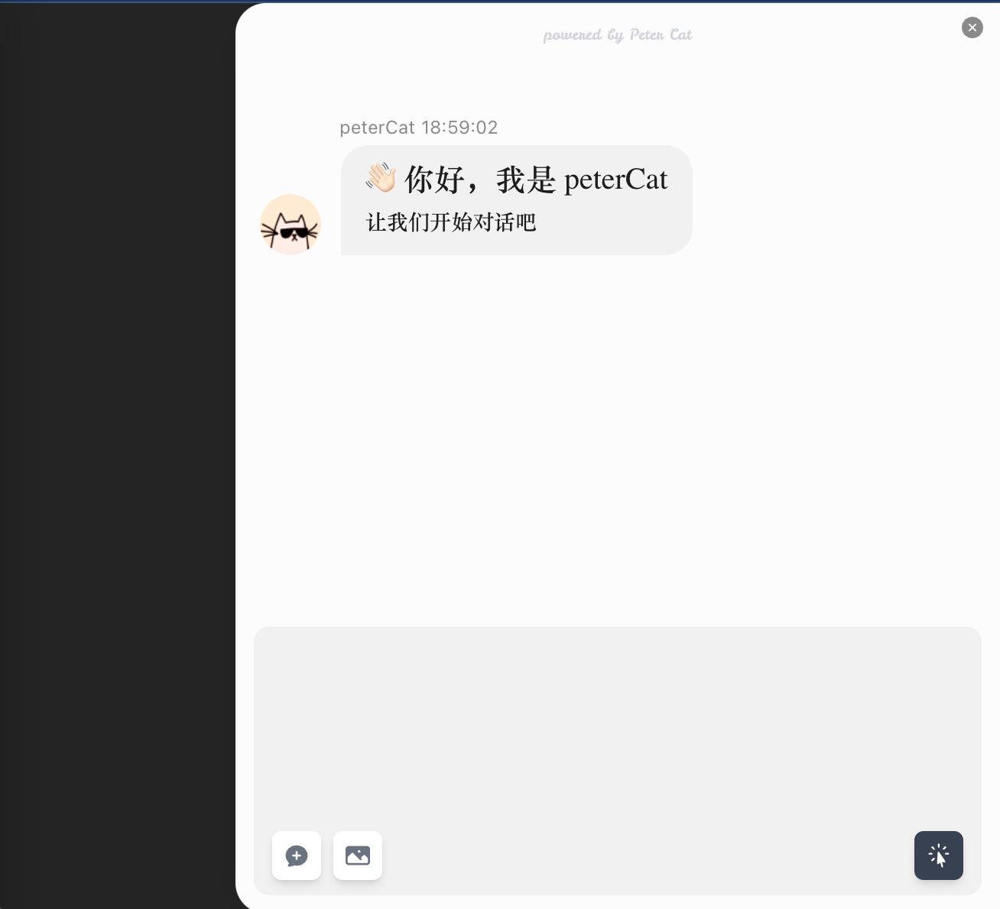
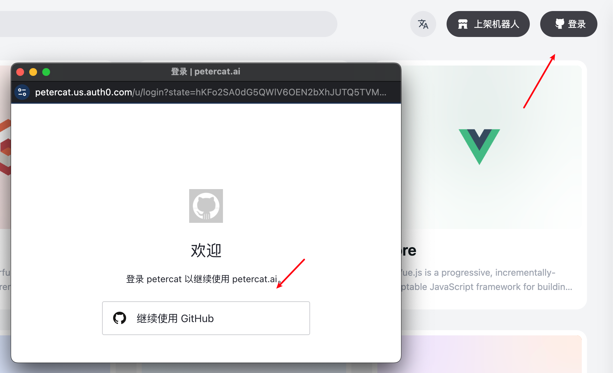
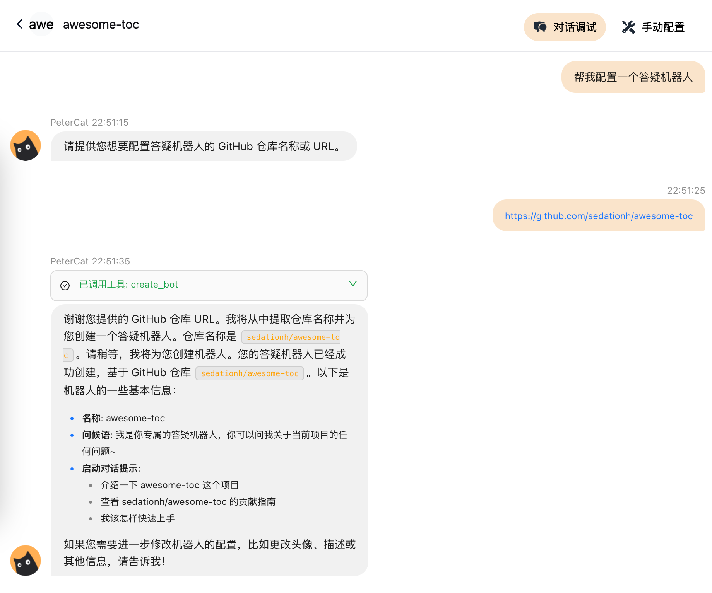
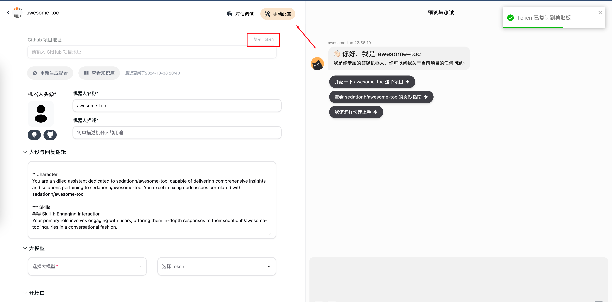

 ## What is it?

Assistant is a chat assistant component with a floating bubble and draggable chat drawer.  


Clicking on the cat will expand the chat drawer.



## Quick Integration

### Token Acquisition

Visit [https://petercat.ai/](https://petercat.ai/), log into the dashboard by clicking on the login button.



Click on the workspace and add a Q&A bot.

Enter your project address to quickly generate the bot.



You can get the token here.



### Code Integration

```zsh
npm install @petercatai/assistant
```

```tsx
import { Assistant } from '@petercatai/assistant';
import '@petercatai/assistant/style';

const YourPetercataiAssistant = () => {
  return <Assistant token="< your token >" />;
};

function App() {
  const [count, setCount] = useState(0);

  return (
    <>
      {/* ... */}
      <YourPetercataiAssistant />
    </>
  );
}
```

For more detailed input parameters, please refer to the documentation.

[petercat/assistant/src/Assistant/index.md at main · petercat-ai/petercat](https://github.com/petercat-ai/petercat/blob/main/assistant/src/Assistant/index.md#api)

## Others

### UMD Integration

Petercat also supports UMD integration.

1. External and UMD load resources

```js
// example for umi project
// .umirc.ts
export default {
  externals: {
    react: 'React',
    'react-dom': 'ReactDOM',
    antd: 'antd',
    dayjs: 'dayjs',
    'lottie-web': 'lottie',
  },
};
```

> [!NOTE]
> Why external?
>
> Smaller, higher cache rate -> faster user experience

Here is a reference example of how to import it.

```html
<head>
  <script src="https://cdn.jsdelivr.net/npm/react/umd/react.development.js"></script>
  <script src="https://cdn.jsdelivr.net/npm/react-dom/umd/react-dom.development.js"></script>
  <script src="https://cdn.jsdelivr.net/npm/dayjs/dayjs.min.js"></script>
  <script src="https://cdn.jsdelivr.net/npm/antd/dist/antd.js"></script>
  <script src="https://cdn.jsdelivr.net/npm/lottie-web/build/player/lottie.js"></script>
  <script src="https://cdn.jsdelivr.net/npm/@petercatai/assistant@1.0.7/dist/umd/assistant.min.js"></script>
  <link rel="stylesheet" href="https://cdn.jsdelivr.net/npm/@petercatai/assistant@1.0.7/dist/umd/assistant.min.css">
</head>
```

2. Load PetercatLUI

```html
<body>
  ...
  <script>
    PetercatLUI.initAssistant({
      apiDomain: 'https://api.petercat.ai',
      token: 'your-token',
      starters: ['Introduce this project', 'View contribution guide', 'How can I get started quickly'],
      clearMessage: true
    });
  </script>
</body>
```

That's it! You can now enjoy the assistant component in your project.  